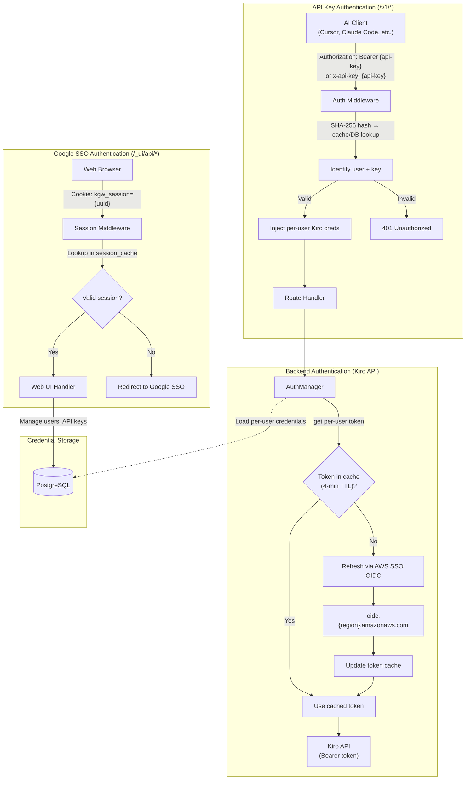
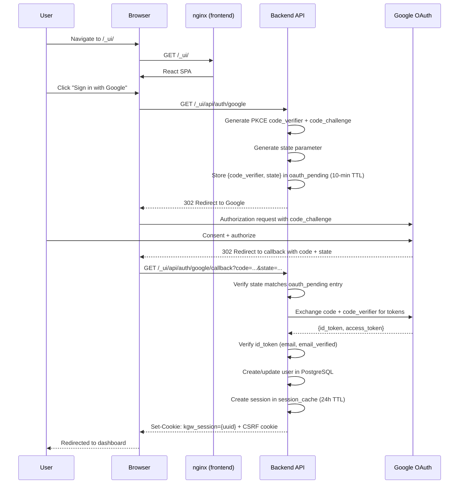
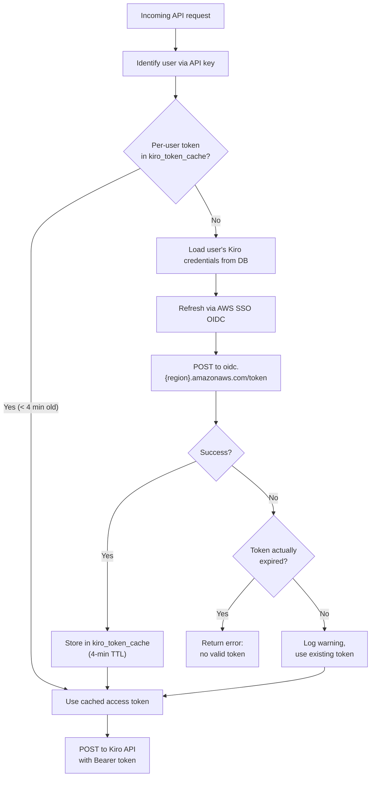
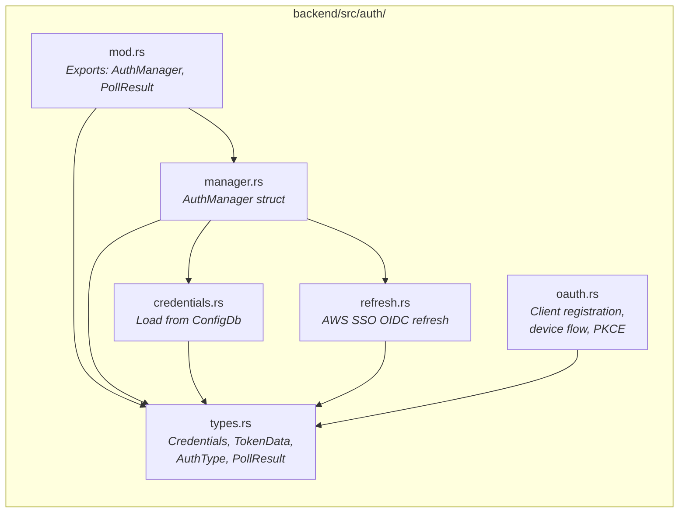
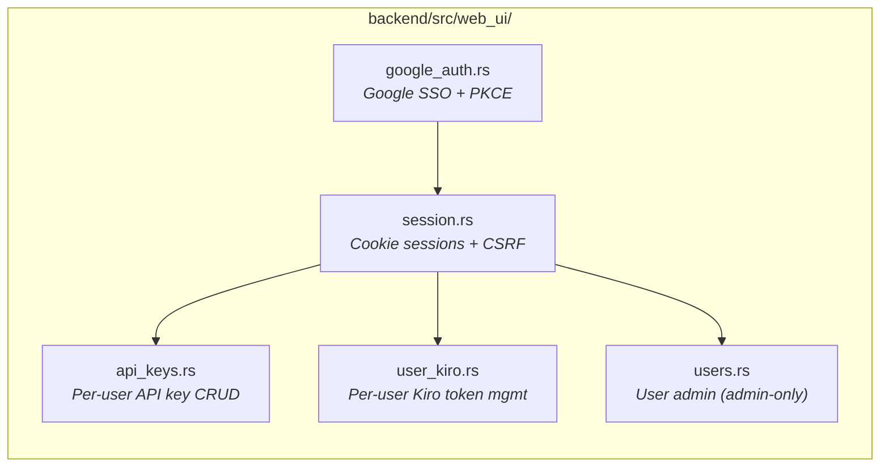

# Authentication System
{: .no_toc }

Kiro Gateway uses a dual authentication model: per-user API keys protect the proxy endpoints (`/v1/*`), while Google SSO with PKCE authenticates users for the web UI (`/_ui/api/*`). The backend then uses per-user Kiro credentials (stored in PostgreSQL) to authenticate against the AWS Kiro API.

## Table of Contents
{: .no_toc .text-delta }

1. TOC
{:toc}

---

## Authentication Architecture Overview



---

## API Key Authentication (Proxy Endpoints)

The auth middleware (`backend/src/middleware/mod.rs`) protects all `/v1/*` proxy routes using per-user API keys.

### How It Works

1. Client sends a request with an API key via `Authorization: Bearer {key}` or `x-api-key: {key}` header
2. Middleware SHA-256 hashes the key
3. Hash is looked up in `api_key_cache` (in-memory DashMap) for fast path
4. On cache miss, hash is looked up in PostgreSQL
5. If found, the user ID and key ID are extracted and per-user Kiro credentials are injected into the request context
6. If not found, a `401 Unauthorized` JSON error is returned

### Per-User API Keys

Each user can create multiple API keys through the web UI. Keys are:
- Generated as random strings and shown to the user once at creation time
- Stored as SHA-256 hashes in PostgreSQL (the plaintext key is never stored)
- Cached in `api_key_cache: Arc<DashMap<String, (Uuid, Uuid)>>` mapping hash to `(user_id, key_id)`
- Individually revocable without affecting other keys

### Routes That Bypass API Key Auth

- `GET /` — Status JSON (for load balancers)
- `GET /health` — Health check
- `/_ui/api/*` — Web UI API routes (protected by session auth instead)
- `POST /mcp` — MCP JSON-RPC server endpoint (no auth — intended for internal/trusted tool aggregation)

---

## Google SSO Authentication (Web UI)

The web UI uses Google SSO with PKCE + OpenID Connect for user authentication. This is implemented in `backend/src/web_ui/google_auth.rs`.

### OAuth Flow



### Session Management

Sessions are managed by `backend/src/web_ui/session.rs`:

- **Session cookie**: `kgw_session` — HttpOnly, Secure, SameSite=Lax, 24-hour TTL
- **CSRF cookie**: Separate cookie for CSRF token validation on mutation requests
- **Session storage**: `session_cache: Arc<DashMap<Uuid, SessionInfo>>` — in-memory, not persisted across restarts
- **SessionInfo** contains: user ID, email, role (Admin/User), expiry timestamp

### CSRF Protection

All mutation endpoints (POST, PUT, DELETE) under `/_ui/api/*` require a valid CSRF token:
- The CSRF token is set as a cookie when the session is created
- Clients must include the token in a request header for mutations
- This prevents cross-site request forgery attacks against the web UI

### Roles

| Role | Capabilities |
|------|-------------|
| Admin | Full access: manage users, update config, manage domain allowlist, manage guardrail profiles/rules, manage MCP clients, all user capabilities |
| User | View metrics, manage own API keys, manage own Kiro credentials |

The first user to complete Google SSO setup is automatically assigned the Admin role.

### Admin-Only Feature Routes

The following feature admin routes follow the same session + CSRF pattern as other Web UI mutation endpoints:

- **Guardrails** (`/_ui/api/guardrails/*`) — CRUD for guardrail profiles and rules, test endpoint, CEL validation. All admin-only with session + CSRF on mutations.
- **MCP Gateway** (`/_ui/api/mcp/*`) — CRUD for MCP clients, reconnect, list tools. All admin-only with session + CSRF on mutations.

---

## Backend Authentication (Kiro API)

Each user has their own Kiro credentials (refresh token, client ID, client secret) stored in PostgreSQL. The `AuthManager` (`backend/src/auth/manager.rs`) handles per-user token lifecycle.

### Per-User Token Flow



The `kiro_token_cache: Arc<DashMap<Uuid, (String, String, Instant)>>` maps user IDs to `(access_token, region, cached_at)` tuples. Tokens are refreshed when older than 4 minutes.

### Kiro Credential Setup

Users configure their Kiro credentials through the web UI. The credentials are stored in PostgreSQL per-user:

| Field | Description |
|-------|-------------|
| `kiro_refresh_token` | OAuth refresh token for Kiro API |
| `kiro_region` | AWS region for API calls (e.g., `us-east-1`) |
| `oauth_client_id` | OAuth client ID from AWS SSO OIDC registration |
| `oauth_client_secret` | OAuth client secret from registration |
| `oauth_sso_region` | AWS region for the SSO OIDC endpoint |

### Token Refresh Mechanism

The token refresh uses AWS SSO OIDC (`backend/src/auth/refresh.rs`):

1. **Proactive refresh**: Tokens are refreshed before they expire. The `kiro_token_cache` 4-minute TTL ensures tokens are refreshed well within typical token lifetimes.

2. **Graceful degradation**: If refresh fails but the token hasn't actually expired yet, the gateway continues using the existing token and logs a warning.

3. **Per-user isolation**: Each user's token refresh is independent. A refresh failure for one user does not affect others.

4. **HTTP client retry**: The `KiroHttpClient` can independently refresh tokens on 403 responses and retry the request.

### The Refresh Request

The OIDC refresh (`backend/src/auth/refresh.rs:refresh_aws_sso_oidc()`) sends a JSON POST to `https://oidc.{sso_region}.amazonaws.com/token`:

```json
{
  "grantType": "refresh_token",
  "clientId": "...",
  "clientSecret": "...",
  "refreshToken": "..."
}
```

The SSO region may differ from the API region (e.g., SSO in `us-east-1` but API in `eu-west-1`). The response provides a new `access_token` and optionally a rotated `refresh_token`.

---

## Setup-Only Mode

On first run (no admin user in DB), the gateway enters setup-only mode:

1. `setup_complete` `AtomicBool` is set to `false`
2. All `/v1/*` proxy endpoints return `503 Service Unavailable`
3. Only the web UI and health endpoints are accessible
4. The first user to complete Google SSO is assigned the Admin role
5. `setup_complete` transitions to `true` and the gateway begins serving proxy requests

This ensures the gateway cannot be used as an open proxy before authentication is configured.

---

## Auth Module Structure



---

## Web UI Auth Module Structure



---

## How Auth Integrates with the Request Flow

The authentication system touches the request flow at two points:

1. **Middleware layer** — The `auth_middleware` SHA-256 hashes the client's API key and looks up the user in cache/DB. If valid, it injects the user's identity and Kiro credentials into the request extensions. This is a fast hash + DashMap lookup, not an OAuth flow.

2. **Handler layer** — Inside `chat_completions_handler` and `anthropic_messages_handler`, the handler retrieves the per-user Kiro access token (from cache or via refresh). This may trigger a background refresh if the token is expiring soon.

The `KiroHttpClient` also holds its own `Arc<AuthManager>` reference for connection-level retry logic. When a request to the Kiro API returns 403, the HTTP client can independently refresh the token and retry without involving the route handler.
