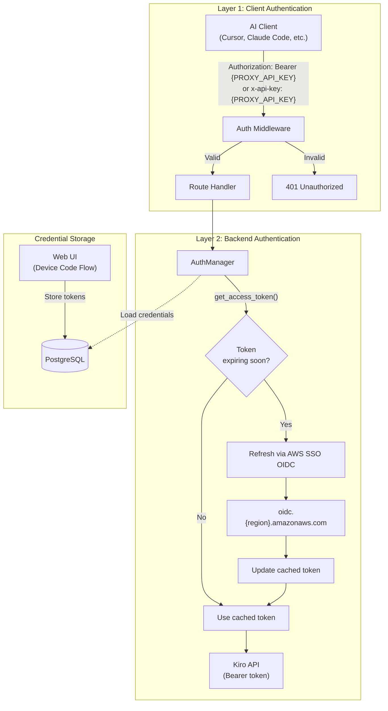
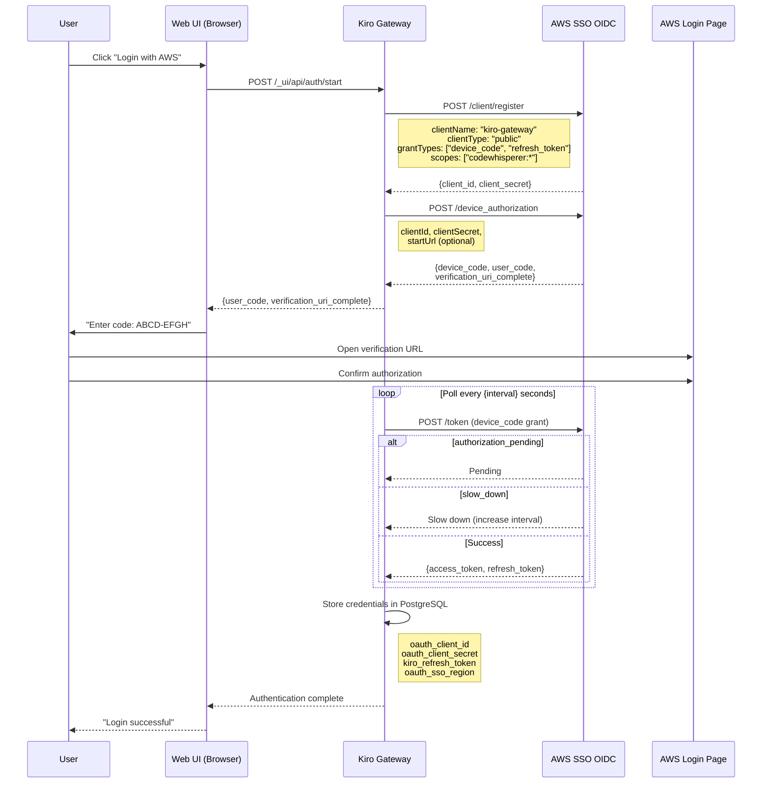
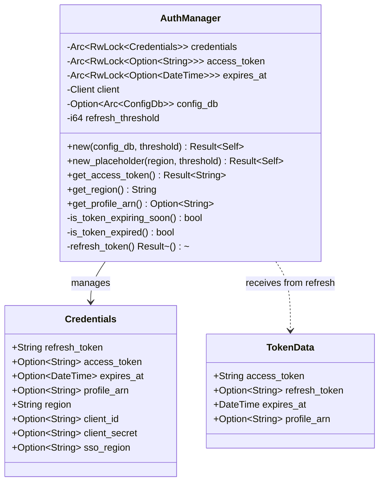
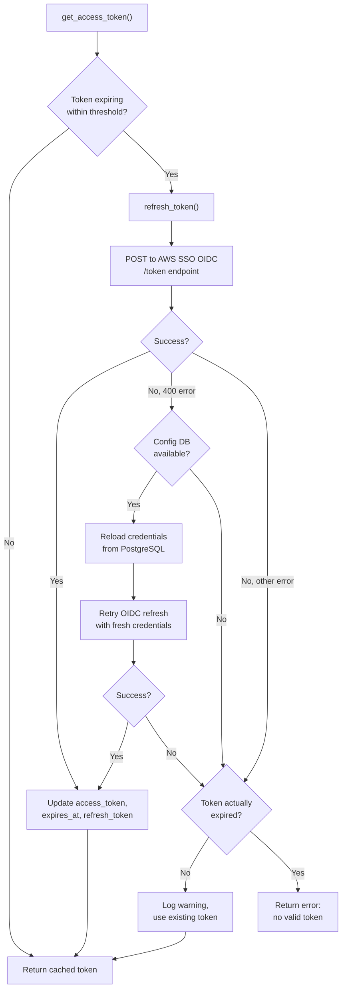
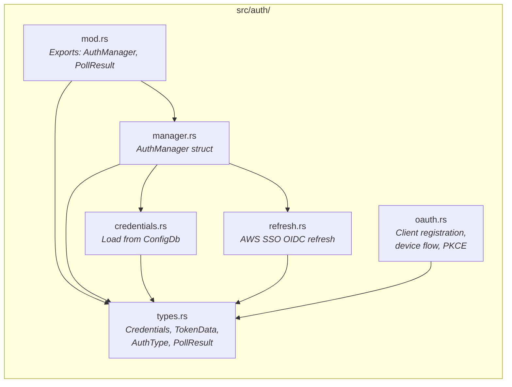

# Authentication System
{: .no_toc }

Kiro Gateway uses a two-layer authentication model: a client-facing API key (`PROXY_API_KEY`) protects the gateway itself, while an OAuth device code flow via AWS SSO OIDC authenticates the gateway against the Kiro backend. This page covers both layers in detail.

## Table of Contents
{: .no_toc .text-delta }

1. TOC
{:toc}

---

## Authentication Architecture Overview



---

## Layer 1: Client-Facing Authentication

The auth middleware (`src/middleware/mod.rs:auth_middleware()`) protects all API routes. It accepts two authentication methods:

### Bearer Token
```
Authorization: Bearer {PROXY_API_KEY}
```

### API Key Header
```
x-api-key: {PROXY_API_KEY}
```

The middleware checks both headers in order. If neither matches the configured `PROXY_API_KEY`, a `401 Unauthorized` response is returned with a JSON error body.

Routes that bypass authentication:
- `GET /` — Simple health check (for load balancers)
- `GET /health` — Detailed health check
- `/_ui/*` — Web UI routes (protected by their own session logic)

The `PROXY_API_KEY` is read from the shared `Config` via `RwLock`, which means it can be changed at runtime through the Web UI without restarting the gateway.

---

## Layer 2: Backend Authentication (AWS SSO OIDC)

The gateway authenticates against the Kiro API using OAuth 2.0 tokens obtained through the AWS SSO OIDC device code flow. The `AuthManager` (`src/auth/manager.rs`) manages the complete token lifecycle.

### OAuth Device Code Flow

The initial authentication is performed through the Web UI. The user triggers a device code flow that registers an OAuth client, obtains a device code, and polls for authorization.



The OAuth module (`src/auth/oauth.rs`) implements all the OIDC protocol operations:

| Function | Purpose |
|----------|---------|
| `register_client()` | Register OAuth client with AWS SSO OIDC |
| `generate_pkce()` | Generate PKCE code verifier and challenge (for browser flow) |
| `build_authorize_url()` | Build authorization URL (for browser flow) |
| `start_device_authorization()` | Initiate device code flow |
| `poll_device_token()` | Poll for device authorization completion |
| `exchange_authorization_code()` | Exchange auth code for tokens (browser flow) |

The gateway supports two OAuth flows:
- **Device code flow** (primary) — Used for headless/CLI setups. The user authorizes on a separate device.
- **Browser redirect flow** — Uses PKCE (S256) for the authorization code exchange via browser redirect.

### Required OAuth Scopes

```
codewhisperer:completions
codewhisperer:analysis
codewhisperer:conversations
```

---

## AuthManager Architecture

The `AuthManager` struct (`src/auth/manager.rs`) is the central token management component. It provides thread-safe access to credentials and handles automatic token refresh.



### Token Refresh Mechanism

The token refresh flow is triggered automatically when `get_access_token()` detects the token is expiring within the `refresh_threshold` (default: 300 seconds / 5 minutes).



Key behaviors:

1. **Proactive refresh**: Tokens are refreshed before they expire, not after. The 5-minute threshold ensures there's always a valid token available.

2. **Credential reload on 400**: If the OIDC endpoint returns a 400 error (typically meaning the refresh token was rotated externally), the AuthManager reloads credentials from PostgreSQL and retries. This handles the case where the Web UI re-authenticated while the gateway was running.

3. **Graceful degradation**: If refresh fails but the token hasn't actually expired yet, the gateway continues using the existing token and logs a warning. This prevents transient OIDC outages from causing immediate failures.

4. **Thread safety**: All token state is behind `tokio::sync::RwLock`, allowing concurrent reads from multiple request handlers while serializing refresh operations.

### The Refresh Request

The actual OIDC refresh (`src/auth/refresh.rs:refresh_aws_sso_oidc()`) sends a JSON POST to `https://oidc.{sso_region}.amazonaws.com/token`:

```json
{
  "grantType": "refresh_token",
  "clientId": "...",
  "clientSecret": "...",
  "refreshToken": "..."
}
```

The SSO region may differ from the API region (e.g., SSO in `us-east-1` but API in `eu-west-1`). The response provides a new `access_token` and optionally a rotated `refresh_token`. Token expiration is calculated as `expires_in - 60 seconds` (a 60-second safety buffer).

---

## Credential Storage in PostgreSQL

Credentials are stored in the gateway's PostgreSQL config database (`web_ui::config_db::ConfigDb`). The credential loader (`src/auth/credentials.rs:load_from_config_db()`) reads:

| Config Key | Description | Required |
|-----------|-------------|----------|
| `kiro_refresh_token` | OAuth refresh token | Yes |
| `kiro_region` | AWS region for API calls | No (default: `us-east-1`) |
| `oauth_client_id` | OAuth client ID from registration | Yes |
| `oauth_client_secret` | OAuth client secret from registration | Yes |
| `oauth_sso_region` | AWS region for SSO OIDC endpoint | No (defaults to `kiro_region`) |

If `oauth_client_id` or `oauth_client_secret` is missing, the credential loader returns an error directing the user to complete the device code login via the Web UI.

---

## Auth Module Structure



---

## How Auth Integrates with the Request Flow

The authentication system touches the request flow at two points:

1. **Middleware layer** — The `auth_middleware` validates the client's `PROXY_API_KEY` before the request reaches any handler. This is a simple string comparison, not an OAuth flow.

2. **Handler layer** — Inside `chat_completions_handler` and `anthropic_messages_handler`, the handler calls `auth_manager.get_access_token()` to obtain a valid Kiro API token. This may trigger a background refresh if the token is expiring soon.

The `KiroHttpClient` also holds its own `Arc<AuthManager>` reference for connection-level retry logic. When a request to the Kiro API returns 403, the HTTP client can independently refresh the token and retry without involving the route handler.

Two separate `AuthManager` instances exist at runtime:
- One owned by `KiroHttpClient` (wrapped in `Arc<AuthManager>`) for retry-level token refresh
- One in `AppState` (wrapped in `Arc<tokio::sync::RwLock<AuthManager>>`) that can be swapped entirely when the user re-authenticates through the Web UI
