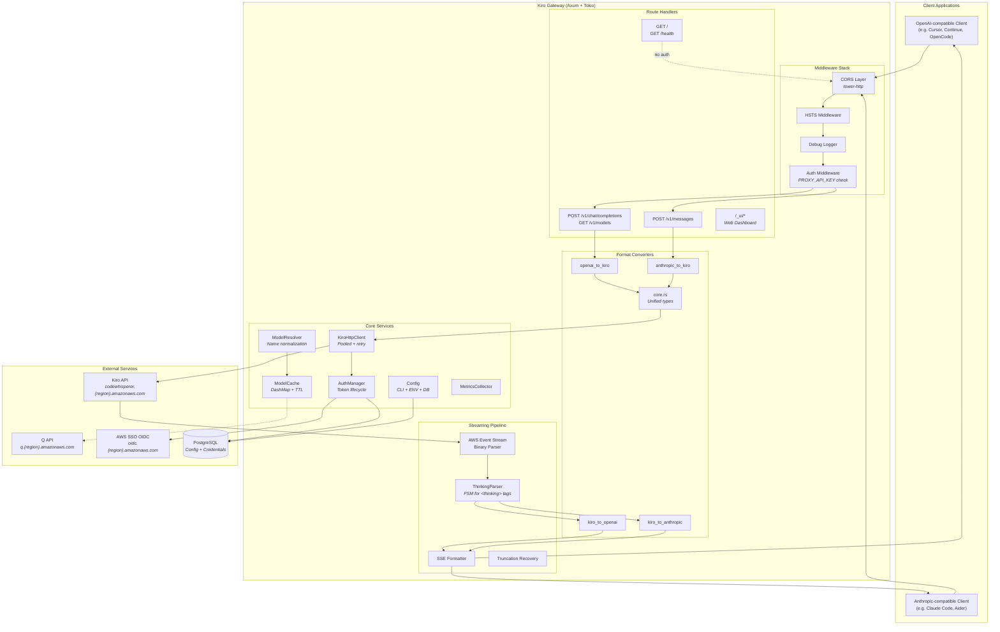
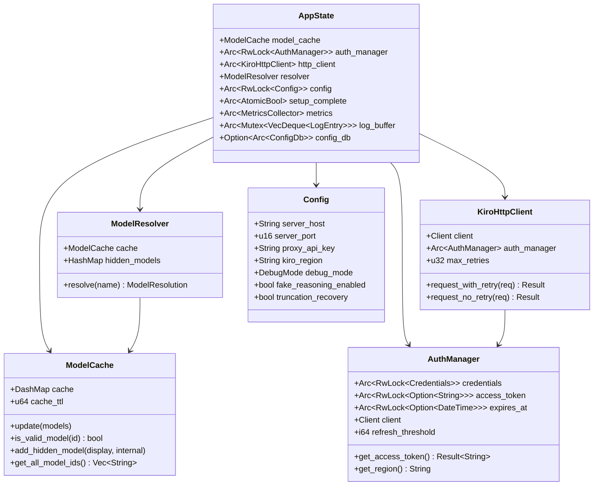
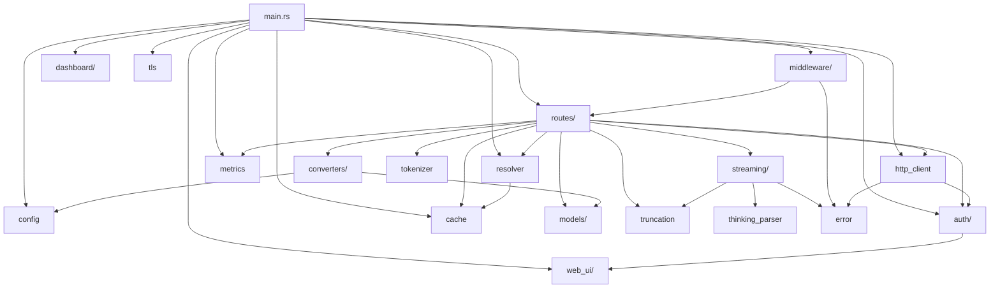

# Architecture Overview
{: .no_toc }

Kiro Gateway is a Rust proxy that exposes OpenAI and Anthropic-compatible APIs, translating requests to the Kiro API (AWS CodeWhisperer) backend. This section provides a comprehensive look at the system's internal architecture, from the high-level component layout down to individual module responsibilities.

## Table of Contents
{: .no_toc .text-delta }

1. TOC
{:toc}

---

## High-Level System Diagram

The gateway sits between AI clients (any tool that speaks the OpenAI or Anthropic protocol) and the Kiro/CodeWhisperer backend on AWS. It handles authentication, format translation, streaming, and extended thinking extraction transparently.

---

## Application State (AppState)

All Axum route handlers share a single `AppState` struct via Axum's state extraction. This struct is the central nervous system of the gateway — it holds references to every core service.

Key design decisions for AppState:

- `auth_manager` is wrapped in `tokio::sync::RwLock` so it can be swapped at runtime after re-authentication via the Web UI.
- `config` uses `std::sync::RwLock` since config reads are synchronous and fast.
- `model_cache` uses `DashMap` internally for lock-free concurrent reads.
- `setup_complete` is an `AtomicBool` that gates API routes — when `false`, only the Web UI and health endpoints are accessible.

---

## Module Dependency Graph

The following diagram shows how the Rust modules depend on each other. Arrows point from the dependent module to the dependency.

---

## Technology Stack

| Layer | Technology | Purpose |
|-------|-----------|---------|
| HTTP Server | [Axum 0.7](https://github.com/tokio-rs/axum) | Async web framework with type-safe extractors |
| Async Runtime | [Tokio](https://tokio.rs/) | Multi-threaded async runtime |
| Middleware | [tower](https://github.com/tower-rs/tower) / tower-http | Composable middleware layers (CORS, logging) |
| HTTP Client | [reqwest](https://github.com/seanmonstar/reqwest) | Connection-pooled HTTP client with TLS |
| TLS | [rustls](https://github.com/rustls/rustls) + ring | Always-on TLS (self-signed or custom cert) |
| Serialization | [serde](https://serde.rs/) + serde_json | JSON serialization/deserialization |
| CLI Parsing | [clap](https://github.com/clap-rs/clap) | CLI argument parsing with env var support |
| Database | [sqlx](https://github.com/launchbadge/sqlx) (PostgreSQL) | Async PostgreSQL for config persistence |
| Caching | [DashMap](https://github.com/xacrimon/dashmap) | Lock-free concurrent hash map |
| Logging | [tracing](https://github.com/tokio-rs/tracing) | Structured, async-aware logging |
| Token Counting | [tiktoken-rs](https://github.com/zurawiki/tiktoken-rs) | GPT-compatible tokenizer (cl100k_base) |
| TUI Dashboard | [ratatui](https://github.com/ratatui-org/ratatui) | Terminal UI for real-time monitoring |
| Web UI | React + Vite (embedded via rust-embed) | Browser-based setup and monitoring |

---

## Design Principles

### 1. Protocol Translation, Not Reimplementation

The gateway does not implement its own LLM logic. It is a pure protocol translator: it accepts requests in OpenAI or Anthropic format, converts them to the Kiro wire format, and converts responses back. The `converters/core.rs` module defines a `UnifiedMessage` type that serves as the intermediate representation between all three formats.

### 2. Always-On TLS

TLS is mandatory. If no custom certificate is provided, the gateway generates a self-signed certificate at startup. This simplifies deployment security — there is no "HTTP mode" to accidentally expose.

### 3. Streaming-First Architecture

The Kiro API always returns responses in AWS Event Stream binary format, even for non-streaming requests. The gateway's streaming pipeline (`streaming/mod.rs`) is the primary response path. Non-streaming responses are simply collected from the stream into a single JSON object.

### 4. Graceful Degradation

The auth system implements graceful degradation: if a token refresh fails but the current token hasn't expired yet, the gateway continues serving requests with the existing token. This prevents transient OIDC failures from causing immediate outages.

### 5. Setup-First Mode

The gateway can start with no configuration. When `setup_complete` is `false`, only the Web UI is accessible. Users complete initial setup (OAuth device code flow, region selection) through the browser, and the gateway transitions to full operation without a restart.

---

## Source File Map

| File | Description |
|------|-------------|
| `src/main.rs` | Entry point, startup orchestration, Axum app builder |
| `src/config.rs` | Configuration from CLI + ENV + .env + PostgreSQL |
| `src/error.rs` | `ApiError` enum with `IntoResponse` for HTTP error mapping |
| `src/cache.rs` | Thread-safe model metadata cache (DashMap) |
| `src/resolver.rs` | Model name normalization and resolution pipeline |
| `src/auth/` | OAuth token lifecycle (manager, credentials, refresh, oauth, types) |
| `src/http_client.rs` | Connection-pooled HTTP client with retry + backoff |
| `src/routes/mod.rs` | Axum route handlers and AppState definition |
| `src/streaming/mod.rs` | AWS Event Stream parser, SSE formatters |
| `src/thinking_parser.rs` | FSM for extracting `<thinking>` blocks from streams |
| `src/converters/` | Bidirectional format translation (OpenAI/Anthropic/Kiro) |
| `src/models/` | Request/response type definitions per API format |
| `src/middleware/` | Auth, CORS, HSTS, and debug logging middleware |
| `src/tokenizer.rs` | Token counting with Claude correction factor |
| `src/truncation.rs` | Truncation detection and recovery injection |
| `src/metrics/` | Request latency, token usage, and error tracking |
| `src/dashboard/` | Optional ratatui TUI for real-time monitoring |
| `src/web_ui/` | Web dashboard (React SPA, config API, SSE logs) |
| `src/tls.rs` | TLS configuration (self-signed or custom cert) |
