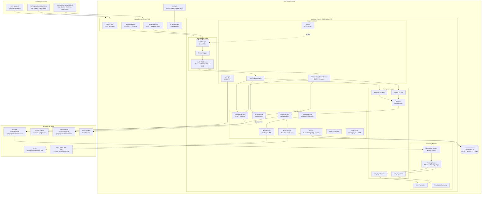
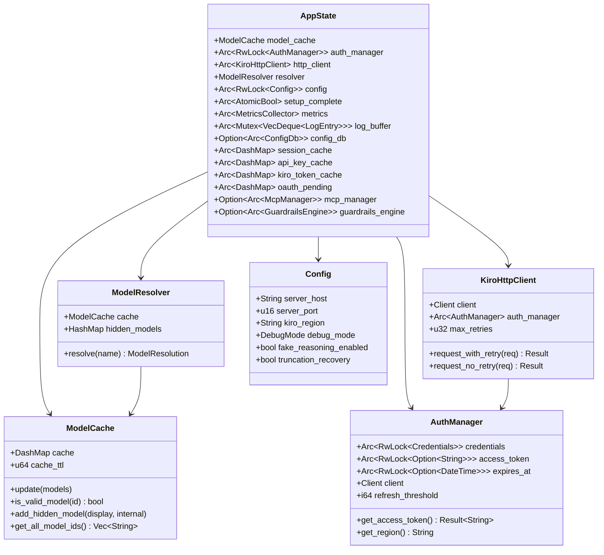
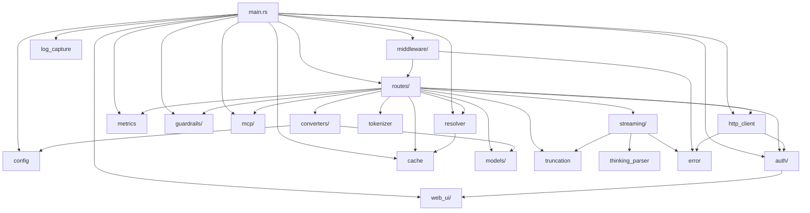

# Architecture Overview
{: .no_toc }

Kiro Gateway is a Rust proxy that exposes OpenAI and Anthropic-compatible APIs, translating requests to the Kiro API (AWS CodeWhisperer) backend. It runs exclusively via docker-compose with four services: a PostgreSQL database, a Rust backend (plain HTTP), an nginx frontend (TLS termination + static SPA), and certbot for automated Let's Encrypt certificate management.

## Table of Contents
{: .no_toc .text-delta }

1. TOC
{:toc}

---

## High-Level System Diagram

The gateway sits between AI clients (any tool that speaks the OpenAI or Anthropic protocol) and the Kiro/CodeWhisperer backend on AWS. It handles authentication, format translation, streaming, and extended thinking extraction transparently.



---

## Docker Services

The gateway runs as four docker-compose services:

| Service | Image | Purpose |
|---------|-------|---------|
| `db` | PostgreSQL 16 | Persistent storage for config, users, API keys, Kiro credentials |
| `backend` | Custom (Rust) | Axum API server on port 8000 (plain HTTP, internal only) |
| `frontend` | Custom (nginx) | TLS termination, static SPA, reverse proxy to backend |
| `certbot` | certbot/certbot | Let's Encrypt certificate provisioning and auto-renewal (12h cycle) |

```
Internet → nginx (frontend, :443/:80)
              ├── /_ui/*           → React SPA static files
              ├── /_ui/api/*       → proxy → backend:8000
              ├── /v1/*            → proxy → backend:8000 (SSE streaming)
              └── /.well-known/    → certbot webroot
           certbot   → Let's Encrypt cert auto-renewal (12h cycle)
           backend   → Rust API server (plain HTTP, internal only)
           db        → PostgreSQL 16
```

---

## Application State (AppState)

All Axum route handlers share a single `AppState` struct via Axum's state extraction. This struct is the central nervous system of the gateway — it holds references to every core service.



Key design decisions for AppState:

- `auth_manager` is wrapped in `tokio::sync::RwLock` so it can be swapped at runtime after re-authentication via the Web UI.
- `config` uses `std::sync::RwLock` since config reads are synchronous and fast.
- `model_cache` uses `DashMap` internally for lock-free concurrent reads.
- `setup_complete` is an `AtomicBool` that gates API routes — when `false`, only the Web UI and health endpoints are accessible.
- `session_cache` maps session UUIDs to `SessionInfo` for Google SSO web UI sessions.
- `api_key_cache` maps SHA-256 hashed API keys to `(user_id, key_id)` tuples for fast per-user auth lookup.
- `kiro_token_cache` stores per-user Kiro access tokens with a 4-minute TTL.
- `oauth_pending` stores PKCE state during OAuth flows with a 10-minute TTL and 10k capacity cap.

---

## Module Dependency Graph

The following diagram shows how the Rust modules depend on each other. Arrows point from the dependent module to the dependency.



---

## Technology Stack

| Layer | Technology | Purpose |
|-------|-----------|---------|
| HTTP Server | [Axum 0.7](https://github.com/tokio-rs/axum) | Async web framework with type-safe extractors |
| Async Runtime | [Tokio](https://tokio.rs/) | Multi-threaded async runtime |
| Middleware | [tower](https://github.com/tower-rs/tower) / tower-http | Composable middleware layers (CORS, logging) |
| HTTP Client | [reqwest](https://github.com/seanmonstar/reqwest) | Connection-pooled HTTP client with TLS |
| Serialization | [serde](https://serde.rs/) + serde_json | JSON serialization/deserialization |
| Database | [sqlx](https://github.com/launchbadge/sqlx) (PostgreSQL) | Async PostgreSQL for users, API keys, config persistence |
| Caching | [DashMap](https://github.com/xacrimon/dashmap) | Lock-free concurrent hash map (models, sessions, API keys, tokens) |
| Logging | [tracing](https://github.com/tokio-rs/tracing) | Structured, async-aware logging with web UI capture |
| Token Counting | [tiktoken-rs](https://github.com/zurawiki/tiktoken-rs) | GPT-compatible tokenizer (cl100k_base) |
| CEL Engine | [cel-interpreter](https://github.com/clarkmcc/cel-rust) | Common Expression Language for guardrail rule conditions |
| TLS Termination | [nginx](https://nginx.org/) | Reverse proxy with Let's Encrypt TLS via certbot |
| Frontend | React 19 + Vite 7 + TypeScript 5.9 | Browser-based admin dashboard served by nginx |

---

## Design Principles

### 1. Protocol Translation, Not Reimplementation

The gateway does not implement its own LLM logic. It is a pure protocol translator: it accepts requests in OpenAI or Anthropic format, converts them to the Kiro wire format, and converts responses back. The `converters/core.rs` module defines a `UnifiedMessage` type that serves as the intermediate representation between all three formats.

### 2. TLS at the Edge

TLS is handled by nginx at the edge. The Rust backend runs plain HTTP on an internal Docker network, simplifying the backend code and deferring certificate management to certbot and nginx. The `init-certs.sh` script handles first-time Let's Encrypt certificate provisioning.

### 3. Streaming-First Architecture

The Kiro API always returns responses in AWS Event Stream binary format, even for non-streaming requests. The gateway's streaming pipeline (`streaming/mod.rs`) is the primary response path. Non-streaming responses are simply collected from the stream into a single JSON object.

### 4. Graceful Degradation

The auth system implements graceful degradation: if a token refresh fails but the current token hasn't expired yet, the gateway continues serving requests with the existing token. This prevents transient OIDC failures from causing immediate outages.

### 5. Setup-First Mode

On first run (no admin user in DB), the gateway blocks `/v1/*` proxy endpoints with 503 and only serves the web UI. The first user to complete Google SSO setup is assigned the admin role. Once setup is complete, the gateway transitions to full operation without a restart.

### 6. Per-User Isolation

Each user has their own API keys and Kiro credentials. The middleware identifies users by SHA-256 hashing the provided API key, looking up the user in cache/DB, and injecting per-user Kiro credentials into the request context. This replaces the old global `PROXY_API_KEY` model.

### 7. Pipeline Extensibility (Guardrails + MCP)

Input guardrails run before format conversion, output guardrails run after response collection (non-streaming only). MCP tools are injected into the request's tool list before conversion. Both features are optional (disabled by default) and fail-open to avoid blocking requests on infrastructure errors.

---

## Source File Map

| File | Description |
|------|-------------|
| `backend/src/main.rs` | Entry point, startup orchestration, Axum app builder |
| `backend/src/config.rs` | Configuration from ENV + `.env` + PostgreSQL overlay |
| `backend/src/error.rs` | `ApiError` enum with `IntoResponse` for HTTP error mapping |
| `backend/src/cache.rs` | Thread-safe model metadata cache (DashMap) |
| `backend/src/resolver.rs` | Model name normalization and resolution pipeline |
| `backend/src/auth/` | OAuth token lifecycle (manager, credentials, refresh, oauth, types) |
| `backend/src/http_client.rs` | Connection-pooled HTTP client with retry + backoff |
| `backend/src/routes/mod.rs` | Axum route handlers and AppState definition |
| `backend/src/streaming/mod.rs` | AWS Event Stream parser, SSE formatters |
| `backend/src/thinking_parser.rs` | FSM for extracting `<thinking>` blocks from streams |
| `backend/src/converters/` | Bidirectional format translation (OpenAI/Anthropic/Kiro) |
| `backend/src/models/` | Request/response type definitions per API format |
| `backend/src/middleware/` | Auth (per-user API key via SHA-256), CORS, debug logging |
| `backend/src/tokenizer.rs` | Token counting with Claude correction factor |
| `backend/src/truncation.rs` | Truncation detection and recovery injection |
| `backend/src/metrics/` | Request latency, token usage, and error tracking |
| `backend/src/log_capture.rs` | Tracing capture layer for web UI SSE log streaming |
| `backend/src/guardrails/` | Content validation: CEL rule engine, AWS Bedrock guardrails, profiles/rules CRUD |
| `backend/src/mcp/` | MCP Gateway: tool server connections (HTTP/SSE/STDIO), tool discovery, execution, JSON-RPC server |
| `backend/src/web_ui/` | Web UI API: Google SSO, sessions, per-user API keys, Kiro tokens, config, users |
