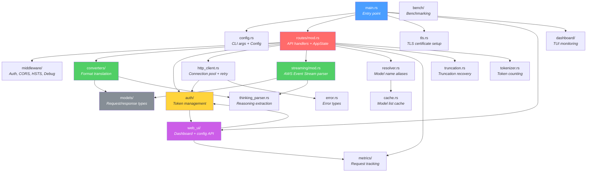

# Module Reference
{: .no_toc }

Overview of all source modules in the Kiro Gateway codebase, their responsibilities, and how they interconnect.
{: .fs-6 .fw-300 }

  
Table of contents

  {: .text-delta }
1. TOC
{:toc}

---

## Module Relationship Diagram

---

## Module Index

### Core Application

| Module | File(s) | Description |
|--------|---------|-------------|
| `main` | `src/main.rs` | Application entry point. Parses config, initializes all subsystems (auth, HTTP client, model cache, TLS, metrics), builds the Axum router, and starts the HTTPS server. |
| `lib` | `src/lib.rs` | Library root. Re-exports all public modules for use by binaries and integration tests. |
| `config` | `src/config.rs` | Configuration management. Defines `CliArgs` (clap-based CLI parser), `Config` struct with all runtime settings, `DebugMode` and `FakeReasoningHandling` enums. Loads from CLI args + `.env` file, validates TLS and dashboard settings. |
| `error` | `src/error.rs` | Error types. Defines `ApiError` enum (`AuthError`, `InvalidModel`, `KiroApiError`, `ConfigError`, `ValidationError`, `Internal`) with `IntoResponse` implementation that maps each variant to an HTTP status code and JSON error body. |

### Request Handling

| Module | File(s) | Description |
|--------|---------|-------------|
| `routes` | `src/routes/mod.rs` | API route handlers and `AppState` definition. Contains handlers for `GET /`, `GET /health`, `GET /v1/models`, `POST /v1/chat/completions`, and `POST /v1/messages`. Manages request lifecycle with `RequestGuard` for metrics tracking. Builds separate router groups for health (unauthenticated), OpenAI (authenticated), and Anthropic (authenticated) routes. |
| `middleware` | `src/middleware/mod.rs`, `src/middleware/debug.rs` | Authentication, CORS, HSTS, and debug logging middleware. `auth_middleware` validates `Authorization: Bearer` and `x-api-key` headers against the configured `PROXY_API_KEY`. `hsts_middleware` adds `Strict-Transport-Security` header. `cors_layer()` creates a permissive CORS layer allowing all origins, methods, and headers. `debug.rs` provides request/response body logging controlled by `DebugMode`. |

### Format Translation

| Module | File(s) | Description |
|--------|---------|-------------|
| `converters` | `src/converters/mod.rs` | Module root for bidirectional format translation between OpenAI/Anthropic and Kiro formats. |
| `converters::openai_to_kiro` | `src/converters/openai_to_kiro.rs` | Converts OpenAI `ChatCompletionRequest` to Kiro's `KiroRequest` format. Maps messages, system prompts, tools, and conversation history. |
| `converters::anthropic_to_kiro` | `src/converters/anthropic_to_kiro.rs` | Converts Anthropic `AnthropicMessagesRequest` to Kiro's `KiroRequest` format. Handles content blocks (text, images, tool use/results, thinking). |
| `converters::kiro_to_openai` | `src/converters/kiro_to_openai.rs` | Converts Kiro streaming events back to OpenAI `ChatCompletionChunk` format. |
| `converters::kiro_to_anthropic` | `src/converters/kiro_to_anthropic.rs` | Converts Kiro streaming events back to Anthropic `StreamEvent` format. |
| `converters::core` | `src/converters/core.rs` | Shared conversion logic used by both OpenAI and Anthropic converters. |

### Data Models

| Module | File(s) | Description |
|--------|---------|-------------|
| `models::openai` | `src/models/openai.rs` | OpenAI-compatible request/response types: `ChatCompletionRequest`, `ChatCompletionResponse`, `ChatCompletionChunk` (streaming), `ModelList`, `OpenAIModel`, `Tool`, `ToolCall`, and usage types. |
| `models::anthropic` | `src/models/anthropic.rs` | Anthropic-compatible types: `AnthropicMessagesRequest`, `AnthropicMessagesResponse`, `ContentBlock` (text, thinking, image, tool_use, tool_result), `StreamEvent` variants (message_start, content_block_delta, etc.), and `Delta` types. |
| `models::kiro` | `src/models/kiro.rs` | Kiro API (AWS CodeWhisperer) types: `KiroRequest` with builder methods (`with_system`, `with_tools`, `with_turns`, `with_images`), `KiroResponse`, `KiroStreamEvent`, turn-based conversation model, and tool configuration types. Uses `camelCase` serialization. |

### Authentication

| Module | File(s) | Description |
|--------|---------|-------------|
| `auth` | `src/auth/mod.rs` | Module root for authentication subsystem. Re-exports `AuthManager` and related types. |
| `auth::manager` | `src/auth/manager.rs` | `AuthManager` — manages Kiro API authentication. Stores access tokens, handles automatic refresh before expiry, provides `get_access_token()` and `get_region()` methods. Supports both testing mode (static token) and production mode (refresh token from PostgreSQL). |
| `auth::oauth` | `src/auth/oauth.rs` | OAuth device code flow implementation via AWS SSO OIDC. Functions for client registration (`register_client`), device authorization (`start_device_authorization`), PKCE generation, authorization URL building, code exchange, and device token polling. |
| `auth::credentials` | `src/auth/credentials.rs` | Credential storage and retrieval helpers. |
| `auth::refresh` | `src/auth/refresh.rs` | Token refresh logic. Handles automatic access token renewal using stored refresh tokens. |
| `auth::types` | `src/auth/types.rs` | Shared authentication types (`PollResult`, token response structures). |

### Streaming & Parsing

| Module | File(s) | Description |
|--------|---------|-------------|
| `streaming` | `src/streaming/mod.rs` | Kiro AWS Event Stream parser. Parses the binary event stream format from the Kiro API into typed `KiroEvent` variants. Provides `stream_kiro_to_openai()`, `stream_kiro_to_anthropic()`, `collect_openai_response()`, and `collect_anthropic_response()` functions for both streaming and non-streaming response handling. |
| `thinking_parser` | `src/thinking_parser.rs` | Extracts reasoning/thinking blocks from model responses. Parses `<thinking>` tags and converts them to structured content blocks for both OpenAI (`reasoning_content`) and Anthropic (`thinking` content block) formats. |
| `truncation` | `src/truncation.rs` | Truncation detection and recovery. Injects recovery instructions into conversation context (`inject_openai_truncation_recovery`, `inject_anthropic_truncation_recovery`) and detects when responses are cut off mid-stream to trigger retries. |
| `tokenizer` | `src/tokenizer.rs` | Approximate token counting for messages, tools, and system prompts. Provides `count_message_tokens()`, `count_anthropic_message_tokens()`, and `count_tools_tokens()` for input token estimation. |

### Infrastructure

| Module | File(s) | Description |
|--------|---------|-------------|
| `http_client` | `src/http_client.rs` | Connection-pooled HTTP client (`KiroHttpClient`) for communicating with the Kiro API. Configurable connection pool size, connect/request timeouts, and automatic retry with exponential backoff. Provides `request_with_retry()` for resilient upstream calls. |
| `tls` | `src/tls.rs` | TLS certificate management. Generates self-signed certificates when no custom cert/key is provided. Configures `axum_server::tls_rustls` for HTTPS serving. TLS is always enabled — the gateway refuses to bind to non-localhost addresses without it. |
| `resolver` | `src/resolver.rs` | Model name resolution. `ModelResolver` maps model name aliases (e.g. `claude-sonnet-4.5`) to canonical Kiro model IDs. Checks the model cache first, then falls back to pattern matching. |
| `cache` | `src/cache.rs` | `ModelCache` — thread-safe cache for the model list fetched from the Kiro API at startup. Provides `get_all_model_ids()` and `update()` methods. Configurable TTL. |
| `utils` | `src/utils.rs` | Miscellaneous utility functions shared across modules. |

### Monitoring & Metrics

| Module | File(s) | Description |
|--------|---------|-------------|
| `metrics` | `src/metrics/mod.rs`, `src/metrics/collector.rs` | `MetricsCollector` — lock-free metrics collection using atomic counters and ring buffers. Tracks active connections, total requests/errors, latency percentiles (p50/p95/p99), per-model statistics (request count, avg latency, input/output tokens), and error breakdown by type. `StreamingMetricsTracker` handles async output token counting for streaming requests. Provides `to_json_snapshot()` for the Web UI. Samples auto-expire after 15 minutes. |

### Web UI

| Module | File(s) | Description |
|--------|---------|-------------|
| `web_ui` | `src/web_ui/mod.rs` | Module root. Builds the Web UI router with authenticated and public API routes. Includes `setup_guard` middleware that returns `503 Service Unavailable` on `/v1/*` endpoints when setup is incomplete. |
| `web_ui::routes` | `src/web_ui/routes.rs` | Web UI HTTP handlers. Serves the embedded React SPA via `rust-embed`. Provides API endpoints for metrics, system info, models, logs (paginated with search), config CRUD, config schema, config history, initial setup, and OAuth flows (browser + device code). Masks sensitive values in config responses. |
| `web_ui::config_api` | `src/web_ui/config_api.rs` | Config field validation and metadata. `classify_config_change()` determines if a field change can be hot-reloaded or requires restart. `validate_config_field()` validates types and ranges. `get_config_field_descriptions()` provides human-readable descriptions for the config UI. |
| `web_ui::config_db` | `src/web_ui/config_db.rs` | `ConfigDb` — PostgreSQL-backed configuration persistence using `sqlx`. Auto-creates `config`, `config_history`, and `schema_version` tables. Provides `get/set/get_all`, `load_into_config()` overlay, `save_initial_setup()`, `save_oauth_setup()`, and `get_history()` with automatic pruning (keeps last 1000 entries). All writes are transactional. |
| `web_ui::sse` | `src/web_ui/sse.rs` | Server-Sent Event streams for the Web UI. `metrics_stream` pushes metrics snapshots every 1 second. `logs_stream` pushes new log entries every 500ms. Both include 15-second keep-alive pings. |

### Dashboard (TUI)

| Module | File(s) | Description |
|--------|---------|-------------|
| `dashboard` | `src/dashboard/mod.rs` | Module root for the optional terminal UI dashboard (enabled with `--dashboard` flag). |
| `dashboard::app` | `src/dashboard/app.rs` | Dashboard application state. Defines `LogEntry` struct used by both the TUI dashboard and the Web UI log buffer. |
| `dashboard::ui` | `src/dashboard/ui.rs` | Terminal UI rendering using `ratatui`. Draws metrics panels, log viewer, and model statistics. |
| `dashboard::event_handler` | `src/dashboard/event_handler.rs` | Keyboard event handling for the TUI (quit, scroll, tab switching). |
| `dashboard::log_layer` | `src/dashboard/log_layer.rs` | Custom `tracing` subscriber layer that captures log events into the shared log buffer for both TUI and Web UI display. |
| `dashboard::widgets` | `src/dashboard/widgets.rs` | Custom ratatui widgets for the dashboard (sparklines, tables, etc.). |

### Benchmarking

| Module | File(s) | Description |
|--------|---------|-------------|
| `bench` | `src/bench/mod.rs` | Module root for the built-in benchmarking tool. |
| `bench::runner` | `src/bench/runner.rs` | Benchmark execution engine. Runs concurrent requests against the gateway and collects timing data. |
| `bench::config` | `src/bench/config.rs` | Benchmark configuration (concurrency, iterations, model selection). |
| `bench::metrics` | `src/bench/metrics.rs` | Benchmark-specific metrics collection and aggregation. |
| `bench::mock_server` | `src/bench/mock_server.rs` | Mock Kiro API server for benchmarking without upstream dependencies. |
| `bench::report` | `src/bench/report.rs` | Benchmark result formatting and reporting. |

### Binaries

| Module | File(s) | Description |
|--------|---------|-------------|
| `bin::probe_limits` | `src/bin/probe_limits.rs` | Standalone binary for probing Kiro API limits (max tokens, rate limits, etc.). |

---

## Key Design Patterns

### AppState

All request handlers receive shared application state via Axum's `State` extractor. The `AppState` struct (defined in `src/routes/mod.rs`) contains:

- `config: Arc<RwLock<Config>>` — runtime configuration (hot-reloadable)
- `auth_manager: Arc<tokio::sync::RwLock<AuthManager>>` — token management
- `http_client: Arc<KiroHttpClient>` — connection-pooled HTTP client
- `model_cache: ModelCache` — cached model list
- `resolver: ModelResolver` — model name alias resolution
- `metrics: Arc<MetricsCollector>` — request/latency/token tracking
- `log_buffer: Arc<Mutex<VecDeque<LogEntry>>>` — recent logs for dashboard
- `config_db: Option<Arc<ConfigDb>>` — PostgreSQL config persistence

### Request Guard

The `RequestGuard` pattern (in `src/routes/mod.rs`) ensures metrics are always updated, even if a request handler panics or returns early. It increments active connections on creation and decrements on drop, recording latency and token counts when `complete()` is called.

### Bidirectional Conversion

Format translation follows a consistent pattern: one file per direction (e.g. `openai_to_kiro.rs`, `kiro_to_openai.rs`). Shared logic lives in `converters/core.rs`. This keeps each conversion self-contained and testable.

### Hot-Reload vs Restart

Configuration changes are classified as either `HotReload` (applied immediately to the runtime `Config`) or `RequiresRestart` (persisted to PostgreSQL but only take effect after restart). See `web_ui/config_api.rs` for the classification logic.
