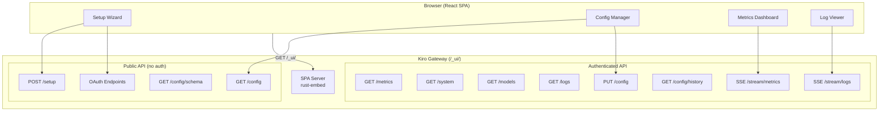
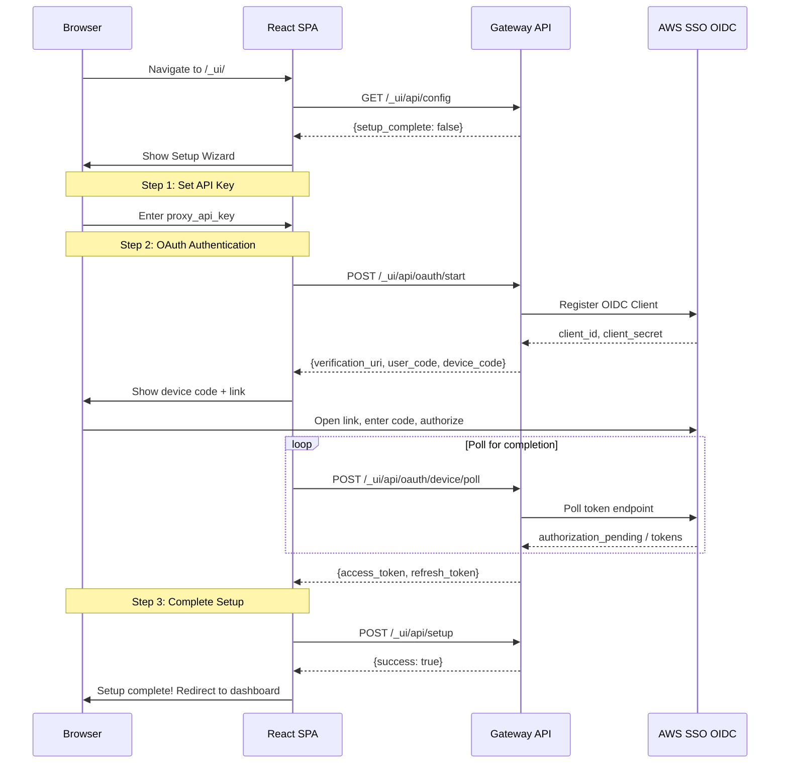

# Web Dashboard

The Kiro Gateway includes a built-in web dashboard served as a React single-page application (SPA) at `/_ui/`. It provides a browser-based interface for initial setup, configuration management, real-time metrics monitoring, and log streaming.

---

## Overview

The web dashboard is embedded directly into the gateway binary using `rust-embed`, meaning there are no external files to serve — the compiled React assets are baked into the executable at build time. The dashboard is enabled by default (controlled by the `WEB_UI` environment variable or `--web-ui` CLI flag).



---

## Accessing the Dashboard

Once the gateway is running, open your browser and navigate to:

```
https://localhost:3000/_ui/
```

Replace `localhost:3000` with your gateway's actual host and port. If TLS is enabled (the default for non-Docker deployments), you'll need to accept the self-signed certificate warning on first visit.

---

## Setup Wizard

When the gateway starts for the first time without any stored configuration, the dashboard presents a multi-step setup wizard. The proxy API endpoints (`/v1/*`) return `503 Service Unavailable` until setup is complete, enforced by the `setup_guard` middleware.

### Setup Flow



### Step-by-Step Walkthrough

1. **API Key Configuration** — Set the `proxy_api_key` that clients will use to authenticate with the gateway. This password protects all `/v1/*` proxy endpoints.

2. **OAuth Device Code Authentication** — The wizard initiates an AWS SSO OIDC device code flow:
   - Click "Start Authentication" to begin
   - A verification URL and user code are displayed
   - Open the URL in your browser and enter the code
   - Authorize the application in AWS SSO
   - The wizard automatically polls for completion

3. **Finalize Setup** — Once authentication succeeds, the wizard saves all configuration to PostgreSQL and marks setup as complete. The proxy endpoints become available immediately.

---

## Configuration Management

After setup, the dashboard provides a configuration panel for viewing and modifying gateway settings.

### Viewing Configuration

The current configuration is available via `GET /_ui/api/config`, which returns all settings with their current values. The schema endpoint (`GET /_ui/api/config/schema`) provides field metadata including types, descriptions, and validation rules.

### Updating Configuration

Configuration changes are submitted via `PUT /_ui/api/config` with a JSON body containing the fields to update:

```json
{
  "log_level": "debug",
  "debug_mode": "errors",
  "truncation_recovery": true
}
```

### Hot-Reload vs Restart-Required

Not all configuration changes take effect immediately. The gateway classifies each setting:

| Change Type | Settings | Behavior |
|---|---|---|
| **Hot-Reload** | `log_level`, `debug_mode`, `fake_reasoning_enabled`, `fake_reasoning_max_tokens`, `truncation_recovery`, `tool_description_max_length`, `first_token_timeout` | Applied immediately, no restart needed |
| **Requires Restart** | `server_host`, `server_port`, `tls_cert_path`, `tls_key_path`, `proxy_api_key` | Saved to database, applied on next gateway restart |

The dashboard UI indicates which settings require a restart after modification.

### Configuration History

The `GET /_ui/api/config/history` endpoint returns a log of all configuration changes, allowing you to track when and what was modified.

---

## Real-Time Metrics

The metrics dashboard provides live monitoring of gateway performance via Server-Sent Events (SSE).

### Metrics Stream

Connect to `GET /_ui/api/stream/metrics` to receive metrics snapshots every 1 second. Each event contains:

```json
{
  "total_requests": 1542,
  "active_requests": 3,
  "total_tokens_in": 245000,
  "total_tokens_out": 189000,
  "avg_latency_ms": 1250,
  "error_count": 12,
  "models": {
    "claude-sonnet-4-20250514": {
      "requests": 800,
      "tokens_in": 150000,
      "tokens_out": 120000
    }
  }
}
```

### System Information

The `GET /_ui/api/system` endpoint provides process-level system metrics:
- CPU usage (percentage)
- Memory consumption (bytes)
- Process uptime

### Available Models

The `GET /_ui/api/models` endpoint returns the list of models currently available through the Kiro API backend, useful for verifying that authentication is working and seeing which models you can use.

---

## Log Streaming

The log viewer provides real-time log streaming via SSE at `GET /_ui/api/stream/logs`.

### How It Works

The gateway maintains an in-memory log buffer (`log_buffer` in AppState). The SSE endpoint polls this buffer every 500ms and emits only new entries since the last check. Each log event contains an array of new entries:

```json
[
  {
    "timestamp": "2026-03-01T12:00:00.000Z",
    "level": "INFO",
    "message": "Request completed: model=claude-sonnet-4-20250514 tokens=1500 latency=1.2s"
  },
  {
    "timestamp": "2026-03-01T12:00:01.000Z",
    "level": "DEBUG",
    "message": "Token refresh: expires_in=3600s"
  }
]
```

### Historical Logs

The `GET /_ui/api/logs` endpoint returns the current contents of the log buffer as a JSON array, useful for loading initial log history when the dashboard first opens.

---

## API Endpoint Reference

All web UI API endpoints are nested under `/_ui/api/`.

### Public Endpoints (No Authentication)

| Method | Path | Description |
|---|---|---|
| `GET` | `/_ui/api/config` | Get current configuration |
| `GET` | `/_ui/api/config/schema` | Get configuration field schema |
| `POST` | `/_ui/api/setup` | Complete initial setup |
| `POST` | `/_ui/api/oauth/start` | Start OAuth device code flow |
| `GET` | `/_ui/api/oauth/callback` | OAuth callback handler |
| `POST` | `/_ui/api/oauth/device/poll` | Poll OAuth device code status |

### Authenticated Endpoints

These require the `proxy_api_key` via `Authorization: Bearer <key>` or `x-api-key: <key>` header.

| Method | Path | Description |
|---|---|---|
| `GET` | `/_ui/api/metrics` | Current metrics snapshot |
| `GET` | `/_ui/api/system` | System info (CPU, memory, uptime) |
| `GET` | `/_ui/api/models` | List available models |
| `GET` | `/_ui/api/logs` | Get log buffer contents |
| `PUT` | `/_ui/api/config` | Update configuration |
| `GET` | `/_ui/api/config/history` | Configuration change history |
| `GET` | `/_ui/api/stream/metrics` | SSE metrics stream (1s interval) |
| `GET` | `/_ui/api/stream/logs` | SSE log stream (500ms poll) |

---

## Architecture

The web UI is implemented across four Rust modules:

- **`web_ui/mod.rs`** — Router construction, separating public and authenticated routes, plus the `setup_guard` middleware
- **`web_ui/routes.rs`** — All HTTP handlers, including the embedded SPA server using `rust-embed`
- **`web_ui/config_api.rs`** — Configuration validation, change classification (hot-reload vs restart), and field descriptions
- **`web_ui/config_db.rs`** — PostgreSQL persistence layer for configuration key-value storage
- **`web_ui/sse.rs`** — Server-Sent Events streams for real-time metrics and log delivery

The React frontend source lives in `web-ui/` (Vite + TypeScript) and is compiled into `web-ui/dist/` during the build process. The `rust-embed` macro embeds these static assets directly into the binary, so the gateway is a single self-contained executable.
