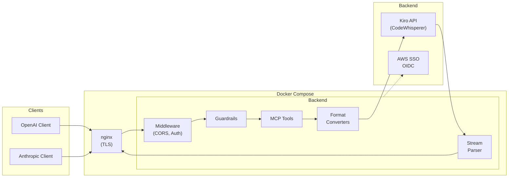

<div class="hero" markdown="0">
  <h1>Kiro Gateway</h1>
  <p class="tagline">
    A multi-user Rust proxy that lets you use OpenAI and Anthropic client libraries
    with the Kiro API (AWS CodeWhisperer) backend. Deployed via Docker Compose with automated TLS.
  </p>
  <div class="badges">
    <span class="badge">Rust</span>
    <span class="badge">Axum 0.7</span>
    <span class="badge">OpenAI Compatible</span>
    <span class="badge">Anthropic Compatible</span>
    <span class="badge">Streaming</span>
    <span class="badge">Multi-User</span>
    <span class="badge">MCP Gateway</span>
    <span class="badge">Content Guardrails</span>
  </div>
</div>

## How It Works

Kiro Gateway sits between your existing AI client code and the Kiro API. Send requests in OpenAI or Anthropic format -- the gateway translates them on the fly, handles per-user authentication, and streams responses back in the format your client expects.



## Features

<div class="features" markdown="0">
  <div class="feature-card">
    <h3>OpenAI Compatible</h3>
    <p>Drop-in replacement for the OpenAI API. Use any OpenAI client library -- just point it at the gateway.</p>
  </div>
  <div class="feature-card">
    <h3>Anthropic Compatible</h3>
    <p>Full support for the Anthropic Messages API, including system prompts, tool use, and content blocks.</p>
  </div>
  <div class="feature-card">
    <h3>Real-time Streaming</h3>
    <p>Parses Kiro's AWS Event Stream binary format and converts to standard SSE in real time.</p>
  </div>
  <div class="feature-card">
    <h3>Multi-User Auth</h3>
    <p>Google SSO for web UI access, per-user API keys for programmatic access. Role-based access control (Admin/User).</p>
  </div>
  <div class="feature-card">
    <h3>Extended Thinking</h3>
    <p>Extracts reasoning blocks from model responses and maps them to native thinking/reasoning content fields.</p>
  </div>
  <div class="feature-card">
    <h3>Web Dashboard</h3>
    <p>Built-in web UI for configuration, user management, API key management, and real-time log streaming.</p>
  </div>
  <div class="feature-card">
    <h3>MCP Gateway</h3>
    <p>Connect external MCP tool servers over HTTP, SSE, or STDIO. Tools are automatically discovered and injected into chat requests with per-request filtering.</p>
  </div>
  <div class="feature-card">
    <h3>Content Guardrails</h3>
    <p>AWS Bedrock-powered content validation with CEL rule engine. Validate input before sending and output before returning, with configurable sampling and fail-open design.</p>
  </div>
</div>

## Quick Start

```bash
# Clone and configure
git clone https://github.com/if414013/rkgw.git
cd rkgw
cp .env.example .env
# Edit .env with your domain, Google OAuth credentials, etc.

# Provision TLS certificates
./init-certs.sh

# Start all services
docker compose up -d --build
```

Then open `https://your-domain.com/_ui/` to complete setup via Google SSO.

## Documentation

<div class="nav-cards" markdown="0">
  <a href="{{ site.baseurl }}/docs/getting-started" class="nav-card">
    <span class="icon">&#128640;</span>
    Getting Started
  </a>
  <a href="{{ site.baseurl }}/docs/architecture" class="nav-card">
    <span class="icon">&#127959;</span>
    Architecture
  </a>
  <a href="{{ site.baseurl }}/docs/api-reference" class="nav-card">
    <span class="icon">&#128214;</span>
    API Reference
  </a>
  <a href="{{ site.baseurl }}/docs/modules" class="nav-card">
    <span class="icon">&#128230;</span>
    Modules
  </a>
  <a href="{{ site.baseurl }}/docs/deployment" class="nav-card">
    <span class="icon">&#128225;</span>
    Deployment
  </a>
  <a href="{{ site.baseurl }}/docs/troubleshooting" class="nav-card">
    <span class="icon">&#128295;</span>
    Troubleshooting
  </a>
</div>

## API Endpoints

| Endpoint | Method | Description |
|----------|--------|-------------|
| `/v1/chat/completions` | POST | OpenAI-compatible chat completions |
| `/v1/messages` | POST | Anthropic-compatible messages |
| `/v1/models` | GET | List available models |
| `/v1/mcp/tool/execute` | POST | Execute MCP tool |
| `/mcp` | POST/GET | MCP JSON-RPC protocol |
| `/health` | GET | Health check |
| `/_ui/` | GET | Web dashboard |
